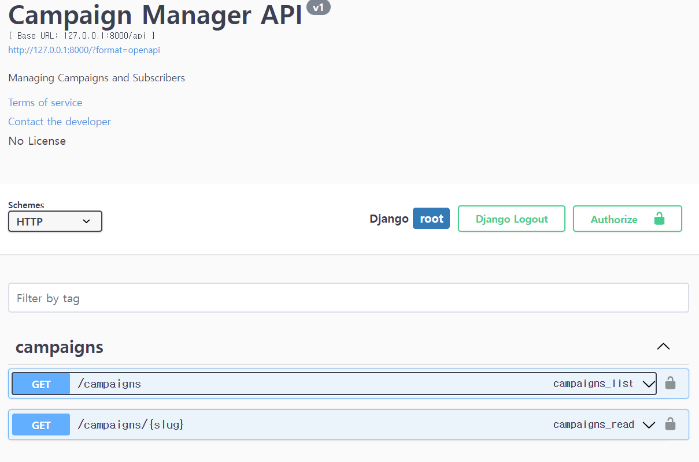
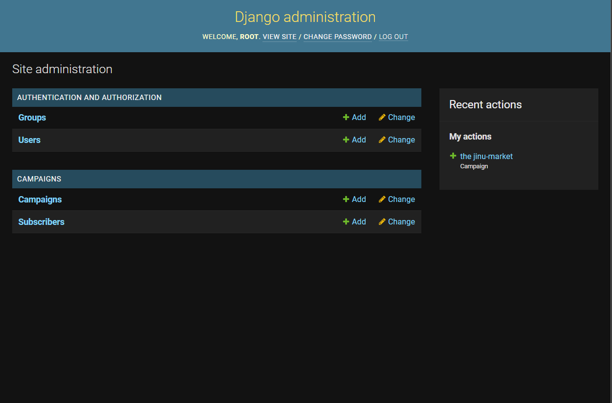
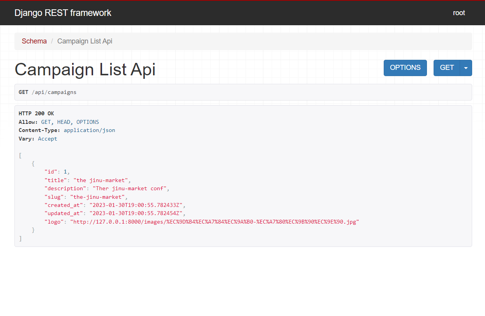

# Campaign Manager

> This app is for practicing django

## Setup

```bash
docker-compose up
```

or you can use dev containers

1. open the command palette `Ctrl+Shift+P`
2. type `Dev Containers: Open Folder in Container`

create superuser to access as admin

```bash
python manage.py createsuperuser
```

run server
```bash
python manage.py runserver
```

## Result

see the result -> [http://127.0.0.1:8000/](http://127.0.0.1:8000/)




see the result -> [http://127.0.0.1:8000/admin/](http://127.0.0.1:8000/admin/)




see the result -> [http://127.0.0.1:8000/api/campaigns/](http://127.0.0.1:8000/api/campaigns/)

